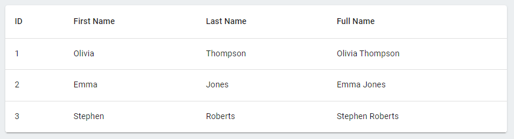

# MUI-datatable

Library to easily generate complex datatables in MUI

## Installation

Using npm:

```bash
npm i @leandri/mui-datatable
```

## Example

1. Import the required type renderers:

```ts
import { text } from '@leandri/mui-datatable'
```

2. Define the data:

```ts
const data = [
  { id: 1, firstname: 'Olivia', lastname: 'Thompson' },
  { id: 2, firstname: 'Emma', lastname: 'Jones' },
  { id: 3, firstname: 'Stephen', lastname: 'Roberts' },
]
```

3. Define the columns:

```ts
const columns = [
  text({ key: 'id', name: 'ID' }),
  text({ key: 'firstname', name: 'First Name' }),
  text({ key: 'lastname', name: 'Last Name' }),
]
```

4. Add the datatable:

```tsx
import { Datatable } from '@leandri/mui-datatable'

const Home = () => (
  <Paper>
    <Datatable rows={data} columns={columns} />
  </Paper>
)
```

# Type renderers

## Text

### Props

| Name      | Type             | Required | Default |
| --------- | ---------------- | -------- | ------- |
| key       | number \| string | Required | -       |
| name      | string           | Required | -       |
| formatter | function         | Optional | -       |
| align     | [align][1]       | Optional | left    |

[1]: (https://mui.com/material-ui/api/table-cell/)

### Example

```ts
import { text } from '@leandri/mui-datatable'

const rows = [
  { id: 1, firstname: 'Olivia', lastname: 'Thompson' },
  { id: 2, firstname: 'Emma', lastname: 'Jones' },
  { id: 3, firstname: 'Stephen', lastname: 'Roberts' },
]

const columns = [
  text({ key: 'id', name: 'ID' }),
  text({ key: 'firstname', name: 'First Name' }),
  text({ key: 'lastname', name: 'Last Name' }),
  text({
    key: 'fullname',
    name: 'Full Name',
    formatter: (row) => `${row.firstname} ${row.lastname}`,
    align: 'justify',
  }),
]
```

### Output



## Number

### Props

| Name  | Type             | Required | Default |
| ----- | ---------------- | -------- | ------- |
| key   | number \| string | Required | -       |
| name  | string           | Required | -       |
| align | [align][1]       | Optional | right   |

### Example

```ts
import { text, number } from '@leandri/mui-datatable'

const rows = [
  { id: 1, firstname: 'Olivia', age: 18 },
  { id: 2, firstname: 'Emma', age: 30 },
  { id: 3, firstname: 'Stephen', age: 28 },
]

const columns = [
  // ...others
  number({
    key: 'age',
    name: 'Age',
    align: 'left',
  }),
]
```

### Output


## Decimal

### Props

| Name      | Type             | Required | Default |
| --------- | ---------------- | -------- | ------- |
| key       | number \| string | Required | -       |
| name      | string           | Required | -       |
| precision | number           | Optional | 2       |
| prefix    | string           | Optional | -       |
| suffix    | string           | Optional | -       |
| align     | [align][1]       | Optional | right   |

### Example

```ts
import { text, decimal } from '@leandri/mui-datatable'

const rows = [
  { id: 1, name: 'Olivia', progress: 62.25, amount: 90720 },
  { id: 2, name: 'Emma', progress: 100, amount: 156000.5 },
  { id: 3, name: 'Stephen', progress: 86, amount: 134060 },
]

const columns = [
  // ...others
  decimal({
    key: 'progress',
    name: 'Progress',
    precision: 1,
    suffix: '%',
    align: 'left',
  }),
  decimal({
    key: 'amount',
    name: 'Amount',
    prefix: '$',
  }),
]
```

### Output


